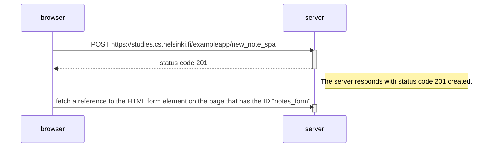

```mermaid
sequenceDiagram
    participant browser
    participant server

    browser->>server: POST https://studies.cs.helsinki.fi/exampleapp/new_note_spa
    activate server
    server-->>browser: status code 201 
    deactivate server
    Note right of server: The server responds with status code 201 created. 

    browser->>server: fetch a reference to the HTML form element on the page that has the ID "notes_form"
    activate server
    deactivate server

```